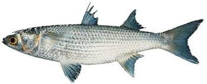

## Sobre a `Pesca da Tainha (Mugil liza) - Estoque Sudeste/Sul`

<center>
<BR />
<a href="http://www.fishbase.se/summary/1090">

</a>
</center>
<BR />

## Contextualização

A tainha (_Mugil liza_) tem sido um importante recurso pesqueiro das
Regiões Sudeste e Sul do Brasil (Seckendorff & Azevedo, 2007). O grande
interesse por este recurso provêm tanto da pesca industrial, vinculado
ao alto valor econômico das gônadas no mercado externo, quanto pela
pesca artesanal, direcionada a atender diretamente as demandas do
mercado interno (Vieira, 1991; Pina & Chave, 2005; Miranda et al.,
2006).  

Por se tratar de uma espécie catádroma, com período reprodutivo
concentrado nos meses de outono e inverno (Abril a Junho), o esforço
pesqueiro tanto artesanal quanto industrial, é intensificado justamente
sobre a alta agregação populacional neste período (Garbin et al, 2014;
Lemos et al., 2014).  

Segundo Lemos et al. (2014), existem condições ambientais que favorecem
as agregações reprodutivas deste estoque, que funcionam como um gatilho,
determinando a saída do recurso do ambiente estuarino para regiões
costeiras, e ainda, influenciando o deslocamento da agregação do estoque
ao longo da costa Sudeste e Sul do país. Os autores ainda relatam que
este padrão de migração está vinculado à faixas ótimas de temperaturas
superficiais da água do mar em torno de 20 ◦ C. Este tipo de gatilho é
bastante comum em outras espécies da família mugilidae (Anderson, 1957;
Moore, 1974; Ibáñez-Aguirre & Gutierrez, 2004).  

Estas características biológicas alinhadas com o fato de se tratar de um
estoque pesqueiro compartilhado entre Brasil e Argentina, resultam em um
cenário complexo para a sua gestão sustentável. Outro desafio importante
a ser considerado é a falta de coletas rotineiras e sistematizadas sobre
produção e esforço pesqueiros empregados pelas diversas pescarias
direcionadas a este recurso em seus distintos momentos de atuação (e.g.
pescarias artesanais atuando durante o ano inteiro dentro dos
estuários).  

Portanto, avaliar a atual situação do estoque para estimar pontos de
referências sustentáveis para este recurso, a partir de modelos
estatísticos que integrem diversas fontesde dados, completos e/ou
parciais, considerando ainda possíveis efeitos climáticos que
nitidamente influenciam a dinâmica desta espécie, parece ser uma
estratégia interessante para produzir informações quantitativas
relevantes à gestão das pescarias direcionadas explotação da tainha
(Mugil liza) no Sudeste e Sul do Brasil.  

### Referências

- Anderson, W. W. 1957. Early development, spawning, growth, and occurrence
of the silver mullet (*Mugil curema*) along the South Atlantic coast of 
the United States. Fishery Bulletin of the Fish and Wildlife Service 57, 
397-414.

- Garbin, T.; Castello, J. P.; Kinas, P. G. 2014. Age, growth and mortality
of the mullet *Mugil liza* in Brazil’s southern and southeastern coastal
regions. Fisheries Research. 149:61-68.

- Ibáñez-Aguirre, L. & Gutierrez, O. 2004. Climate variables and spawning 
migrations of the striped mullet and white mullet in the north-western 
area of the Gulf of Mexico. Journal of Fish Biology 65, 822-831. 
doi: 10.1111/j.1095-8649.2004.00488.x

- Lemos, V. M.; Varela Jr., A. S.; Schwingel, P. R.; Muelbert, J. H. & 
Vieira, J. P. 2014. Migration and reproductive biology of *Mugil liza*
(Teleostei: Mugilidae) in south Brazil. Journal of Fish Biology. 
85: 671-687.

- Miranda, L. V. de.; Mendonça, J. T. & Cergole, M. C. 2006. Diagnóstico do 
estoque e orientações para o ordenamento da pesca de *Mugil platanus* 
(Gunther 1980). Série Documentos REVIZEE - Score Sul. São Paulo: Instituto
Oceanográfico - USP.

- Moore, R. H. 1974. General ecology, distribution and relative abundance 
of *Mugil cephalus* and *Mugil curema* on the south Texas coast. 
Contributions in Marine Science 18, 241-245.

- Pina, J. V. de. & Chaves, P. de. T. 2005. A pesca da tainha e parati na 
Baía de Guaratuba, Paraná, Brasil. Acta Biológica Paranaense 34, 103-113.

- Vieira, J. P. 1991. Juvenile mullets (Pisces: *Mugilidae*) in the estuary 
of Lagoa dos Patos, RS Brazil. Copeia, 409–418.

## Rodando esta aplicação no R...

Para rodar esta aplicação localmente, em seu computador, basta executar
os seguintes comandos no console do **R**.  

```{r} 
 install.packages(c("shiny", "shinydashboard", "ggplot2", "grid", 
                    "markdown", "ggExtra"), dependencies = TRUE)
 shiny::runGitHub("mugil_dash_ver02", "rodrigosantana")
```

## Licença deste *software*

Licença Creative Commons 4.0

<a href="https://creativecommons.org/licenses/by-nc-nd/4.0/">

</a>
<BR />

## Autores

Rodrigo Sant'Ana | rsantana@univali.br  
Paul Gerhard Kinas | pgkinas@gmail.com

## Créditos

Esta aplicação foi toda desenvolvida com
[shiny](http://shiny.rstudio.com/) dentro do ambiente estatístico
computacional [R](http://www.r-project.org/).
